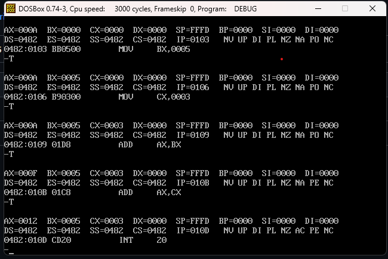
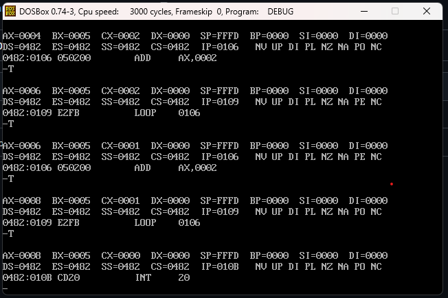

# Quintero-Carrillo-post2-u3
Laboratorio Post-Contenido 2 - Traza paso a paso y LOOP
Arquitectura de Computadores  
Unidad: 3 — Manejo del DEBUG  
Estudiante: Neidys Mariana Quintero Carrillo

## Descripción
El presente laboratorio implementa dos programas en ensamblador x86 usando
el comando A del DEBUG, ejecutándolos instrucción a instrucción con el comando
T para observar el comportamiento de registros y banderas en cada paso.

## Parte A
## Checkpoint 1 — Traza del programa de suma

## Tabla de traza — Programa de suma

| # T | Instrucción ejecutada | AX     | BX     | CX     | IP sig. | ZF | CF | SF | PF |
|-----|-----------------------|--------|--------|--------|---------|----|----|----|----|
| 1   | MOV AX, 000A          | 0x000A | 0x0000 | 0x0000 | 0103    | NZ | NC | PL | PO |
| 2   | MOV BX, 0005          | 0x000A | 0x0005 | 0x0000 | 0106    | NZ | NC | PL | PO |
| 3   | MOV CX, 0003          | 0x000A | 0x0005 | 0x0003 | 0109    | NZ | NC | PL | PO |
| 4   | ADD AX, BX            | 0x000F | 0x0005 | 0x0003 | 010B    | NZ | NC | PL | PE |
| 5   | ADD AX, CX            | 0x0012 | 0x0005 | 0x0003 | 010D    | NZ | NC | PL | PE |

**Observaciones:** AX acumuló correctamente 0x000A + 0x0005 + 0x0003 = 0x0012
(18 decimal). Las instrucciones MOV no afectan banderas. Las instrucciones ADD
activaron NZ porque el resultado no fue cero en ningún caso.

## Checkpoint 2 — Traza del programa con bucle LOOP

## Tabla de traza — Programa con bucle LOOP

| # T | Instrucción   | AX     | BX     | CX     | IP sig. | ¿LOOP salta? |
|-----|---------------|--------|--------|--------|---------|--------------|
| 1   | MOV AX, 0000  | 0x0000 | 0x0005 | 0x0000 | 0103    | —            |
| 2   | MOV CX, 0004  | 0x0000 | 0x0005 | 0x0004 | 0106    | —            |
| 3   | ADD AX, 0002  | 0x0002 | 0x0005 | 0x0004 | 0109    | —            |
| 4   | LOOP 0106     | 0x0002 | 0x0005 | 0x0003 | 0106    | Sí (CX=3)    |
| 5   | ADD AX, 0002  | 0x0004 | 0x0005 | 0x0003 | 0109    | —            |
| 6   | LOOP 0106     | 0x0004 | 0x0005 | 0x0002 | 0106    | Sí (CX=2)    |
| 7   | ADD AX, 0002  | 0x0006 | 0x0005 | 0x0002 | 0109    | —            |
| 8   | LOOP 0106     | 0x0006 | 0x0005 | 0x0001 | 0106    | Sí (CX=1)    |
| 9   | ADD AX, 0002  | 0x0008 | 0x0005 | 0x0001 | 0109    | —            |
| 10  | LOOP 0106     | 0x0008 | 0x0005 | 0x0000 | 010B    | No (CX=0)    |
| 11  | INT 20        | —      | —      | —      | —       | Termina      |

**Observaciones:** LOOP 0106 se codifica como E2 FB. El byte E2 es el opcode
de LOOP y FB es el desplazamiento relativo firmado (-5 en decimal), calculado
como 0x0106 - 0x010B = -5. CX decrementó de 4 a 0 en cada iteración.
Cuando CX llegó a 0x0000, LOOP no saltó y el programa continuó hacia INT 20.
AX acumuló 4 sumas de 2, resultando en 0x0008 = 8 decimal.

## Análisis del código máquina (Paso 8)

El volcado `D CS:100 L0C` muestra los bytes del programa de bucle:
`B8 00 00 B9 04 00 05 02 00 E2 FB CD 20`

- `MOV AX,0000` → `B8 00 00` (3 bytes: opcode + inmediato little-endian)
- `MOV CX,0004` → `B9 04 00` (3 bytes: opcode + inmediato little-endian)
- `ADD AX,+02`  → `05 02 00` (3 bytes)
- `LOOP 0106`   → `E2 FB`    (2 bytes: opcode + desplazamiento relativo)
- `INT 20`      → `CD 20`    (2 bytes)

El programa completo ocupa 13 bytes. El formato little-endian es evidente:
el valor 0x0004 se almacena como `04 00` (byte menos significativo primero).

## Conclusiones
La instrucción LOOP demostró ser un mecanismo eficiente de bucle que combina
decremento de CX y salto condicional en una sola instrucción de 2 bytes. La
traza paso a paso con T permitió verificar que el procesador actualiza registros
y banderas de forma precisa después de cada instrucción. El análisis del código
máquina confirmó el uso de direccionamiento relativo firmado en los saltos cortos.
